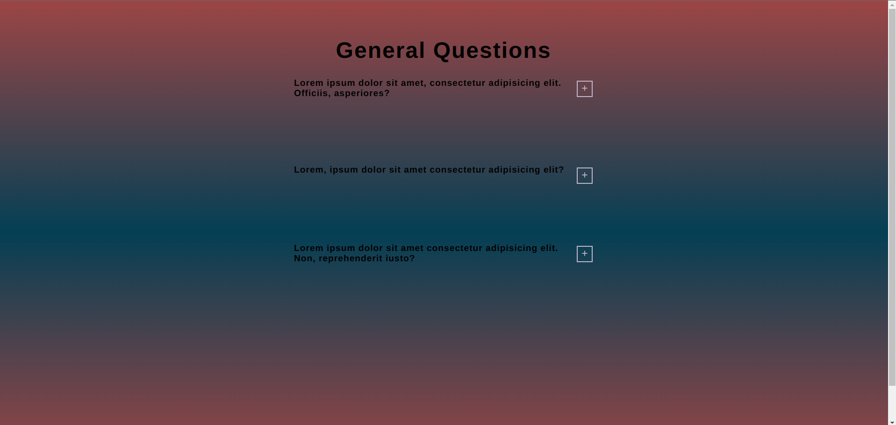
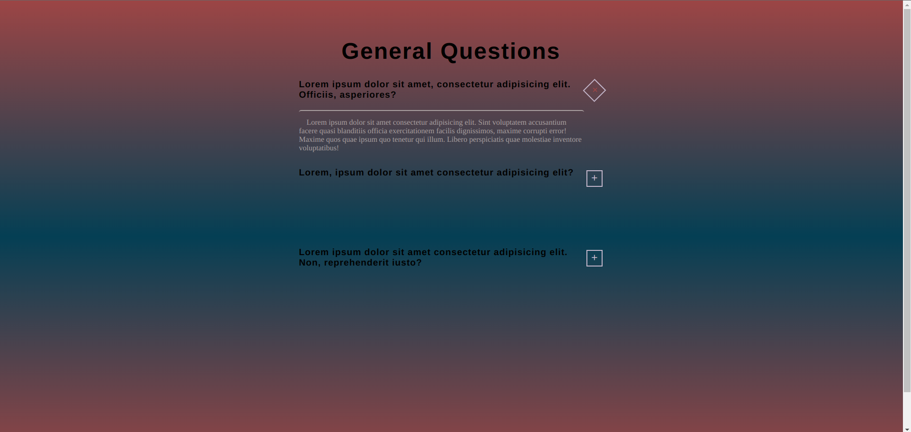

# QUESTIONS PROJECT

## FRONTEND PRACTICE PROJECT NO: 7

1. I used Javascript, Jquery, HTML, CSS to practice my skills.

2. On load there are frequently asked questions. When we click to button on right it displays the answer. On second click turns off.
